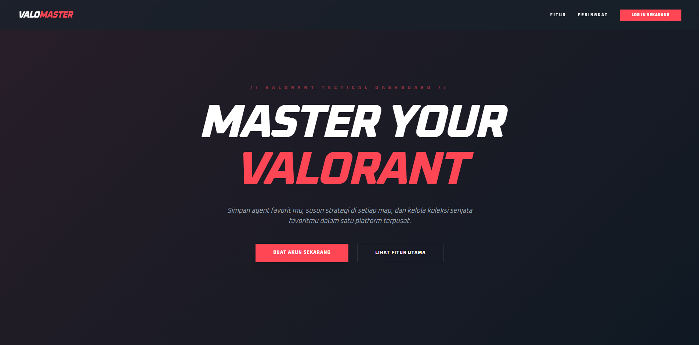
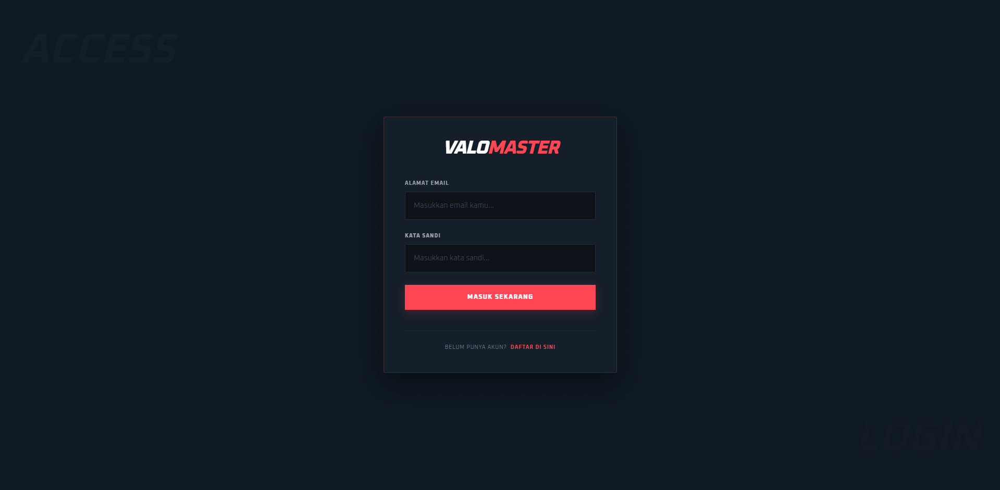
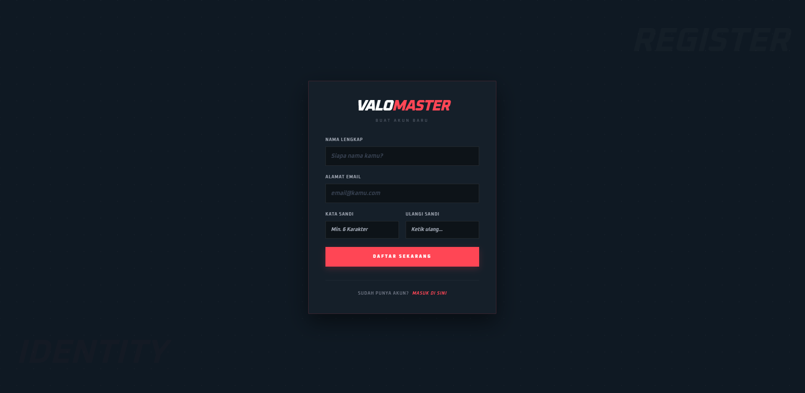
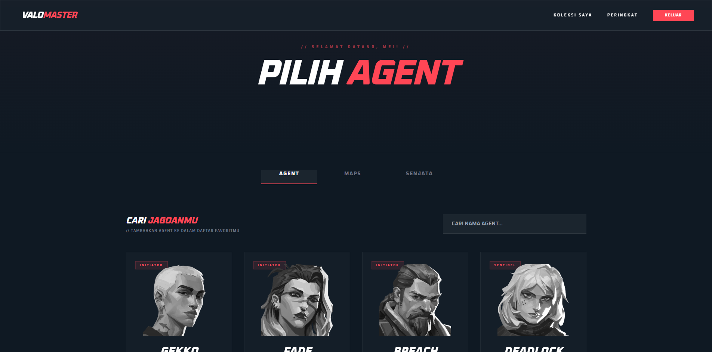
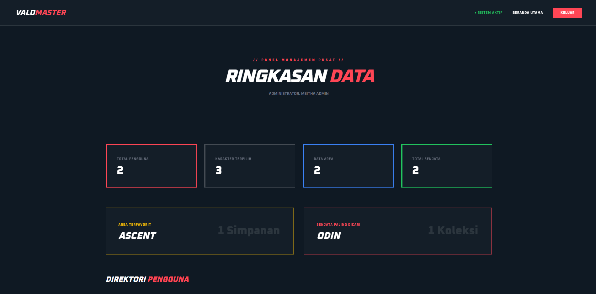

VALOMASTER // Strategic Intelligence Dashboard

ValoMaster adalah aplikasi berbasis web yang dirancang untuk mengelola data taktis permainan Valorant. Aplikasi ini mengintegrasikan data real-time dari Valorant API untuk membantu pengguna mengelola koleksi agen, memetakan strategi di berbagai map, dan memantau aset senjata. Proyek ini juga dilengkapi dengan fitur Admin Panel untuk analisis data mining sederhana.

---

PROFIL 

Nama            : Meitha Amanda
NIM             : 2307005
Program Studi   : Sistem Informasi 2023

---

TEKNOLOGI YANG DIGUNAKAN

Framework           : Laravel 12.x
Bahasa Pemrograman  : PHP 8.2
Frontend Styling    : Tailwind CSS
Interactivity       : Alpine.js
Database            : MySQL
Sumber Data         : (https://dash.valorant-api.com/)

PANDUAN INSTALASI

1. Persiapan Awal
   Pastikan sudah menginstall Composer, Node.js, dan server lokal seperti XAMPP atau WampServer.

2. Clone Repository
   Jalankan perintah berikut di terminal:
        git clone (https://github.com/MeithaAmanda/2307005_MeithaAmanda-valomaster.git)
        cd 2307005-valomaster

3. Install Dependency Backend
        composer install

4. Copy File Environment
        cp .env.example .env

5. Generate Application Key
        php artisan key:generate

6. Konfigurasi Database
        Atur konfigurasi database di file .env sesuai dengan database lokal Anda.

7. Migrasi Database
        php artisan migrate

8. Install Dependency Frontend
        npm install
        npm run build

9. Jalankan Server
        php artisan serve

Aplikasi dapat diakses melalui browser di alamat (http://localhost:8000)

Akun Admin:
Admin: meitha@admin.com | Password: password123

--SCREENSHOOT APLIKASI--

1. Halaman Utama (Landing Page)

2. Autentikasi
 |  |

3. Halaman Pengguna

4. Dashboard Admin

